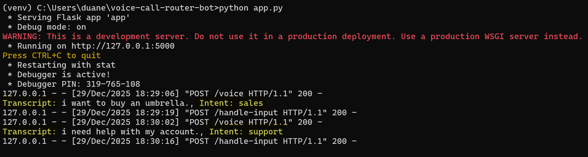
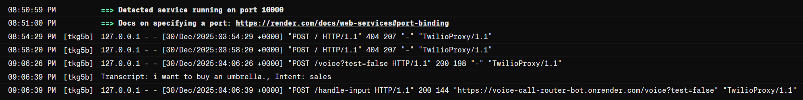

# Voice Call Router Bot

A Python-based voice chatbot using Twilio for telephony and keyword-based intent detection to route calls (sales, support, agent).

## Features
- Answers incoming calls
- Transcribes speech using Twilio STT
- Detects intent with keywords (e.g., "buy" → sales)
- Routes accordingly and logs transcript/intent
- Secure API keys via .env

## Setup
1. Clone repo
2. `python -m venv venv`
3. `venv\Scripts\activate`
4. `pip install flask twilio python-dotenv`
5. Create `.env` with `TWILIO_ACCOUNT_SID`, `TWILIO_AUTH_TOKEN`
6. Buy Twilio number and set webhook to ngrok URL + `/voice`
7. Run `ngrok http 5000` and `python app.py`
     7.a. Moved from using ngrok locally to using Render.com for 24/7 cloud access.
     7.b. Live URL: https://voice-call-router-bot.onrender.com

## Demo
Call the Twilio number (866-402-6277) and say:
- "I want to buy an umbrella" → "Routing to sales queue."
- "I need help with my account" → "Routing to support."

Transcript and intent logged in console and call_log.txt file:

Transcript and logging after move to Render:

Built as a portfolio project to demonstrate cloud telephony, NLP basics, and clean code.